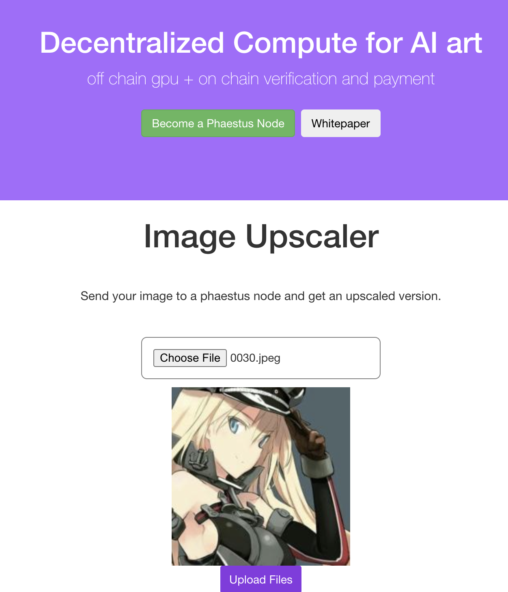

# graphiti network 🎨

## Code:
Phaaestus Node:
./phaestus.py and /phaestus/runUpscale.sh (GAN is set up elsewhere)

Client:
phaestus/dummy_client.py -> demo purposes
/graphiti-frontend

Contracts:
blockchain/contracts/

Deprecated Contracts (Currently unused):
graphiti-client/contracts/

## Inspiration
We were lounging around on a cold evening, talking about how Blockchain and AI were two technological waves that were sweeping through the Tech Industry and we didn't know which one to hop onto. Being greedy and very much in choice paralysis, we decided to find a way to combine them. In our efforts to reconcile two very different technologies, Graphiti was born. 

Let’s consider the case of upscaling (creating better resolution) images from blurry or low quality ones. One can whip up their own code to do so, and engage with GPU-compute clusters provided by large data service companies (E.g: Google). You will need to jump through dev-ops hoops and also pay quite a lot for these services. Alternatively, there are “ready-to-use” image upscaling solutions (which involve running deep generative models) that are provided by centralized service providers at a steep markup.

 We recognized that offering compute-as-a-service should not be monopolized. Anyone with available compute power should be able to generate value from it.  Furthermore, if you are using a data service, your information should not have to be visible to these third parties, nor should it be duplicable and lose unique value.

**This is where Graphiti steps in**

## What it does
Graphiti offers cost efficient and decentralized GPU computation services. Anyone with a computer who doesn’t use it literally every second of the day can join the Graphiti Network to become a Phaestus Node. Phaestus nodes offer their idle computational power to the network to earn Cryptocurrency (currently L2 Eth from Arbitrum). Clients submit compute requests at a certain amount of currency to the Graphiti network via a smart contract. Valid requests are broadcasted and snatched up by the Phaestus nodes, who produce the result and return it to the smart contract. Then an exchange takes place, where the held currency is deposited into the Phaestus node address, and the computed result is offered back to the client.

## Ideals, Realistic Goals

A keen reader would have noticed that this process has certain flaws. Firstly a node could return a bogus result and just claim its reward. Also, the client here would be sending their data to a complete stranger.

Thus we realize that the class of problems that are solvable, whilst maintaining both anonymity and integrity, are those that are both parallelizable and verifiable.

For a proof of concept, Image Upscaling is one such task. A single image can be broken down into an nxn pieces, independently upscaled and stitched together. An upscaled image can be easily deconvolved to create the original image, and thus serve as a confirmation. 

*Note: All GPU computations are parallelizable (grain of salt here) and can be broken down into analytic operations. Fully Homomorphic Encryption can thus provide anonymity, integrity and verification.

## How we built it

We realized that the idea of doing computations off-chain for speed and cost effectiveness was the motivation behind rollups. We decided to build on Arbitrum to reduce costs and increase speed (as compared to running on Ethereum). 

Hardhat compiles and deploys the solidity smart contract infrastructure via Infura onto the Rinkeby testnet. We integrate it with Metamask.

The Client uploads an image. This image is hosted on a file-hosting service (currently cloudinary, will be something like IPFS later), and its url is sent as part of the request to the smart contract.

Phaestus listens to emits by the contract and claims the image job. It fetches the image and runs a Generative Adversarial Network (only available service right now) to create an upscaled image. It uploads this image to cloudinary and returns the image url to the smart contract. 

The client is periodically checking for changes in its job status. It reads from the blockchain when it detects an update, and fetches the new url. It downloads the image and serves it to the client.

## Challenges we ran into
Both of us were complete newbies to the Blockchain development space. One of us spent Friday absorbing how ether.js works while the other learnt Solidity from scratch. Then we slowly conceptualized our ideas into a coding framework. Thus we faced a lot of challenges that new developers in the space end up encountering. However working through them was a rewarding experience, and you can't really unlearn the patience it takes to wade through stack overflow :)

## Accomplishments that we're proud of
We are very happy to have successfully brought a creative DApp idea to life, which not only brings value to the AI and graphics users, but to the community in general. Anyone with a computer can become a phaestus node and start creating value! Our contract is deployed on Arbitrum. Unfortunately, we've encountered some bugs there (a last minute error that we want to but don't have the time to fix), but our Ethereum deployment is up and running!

## What we learned
We learnt how to build as a team, and incrementally execute ideas. With the help of the Hackathon TAs and numerous friendly Internet forums, we learnt how to integrate services like Hardhat, Metamask, Infura, Truffle, Rinkeby and Remix to serve as a development environment. We learnt how (and why) L2 solutions like Arbitrum need to provide easy portability from their L1 counterparts (from a developers standpoint). By deploying this POC, we also learnt that the life of Graphiti has just barely begun.

## What's next for Graphiti
We had more ideas than we could execute in these past three days (as is true for any good hackathon experience :) ) So here is a brief roadmap of our journey ahead!

Handle traffic on Image Upscaling Requests
Integrate both Client and Phaestus with Metamask
Break up image computation across Phaestus nodes
Implement probabilistic verification for image upscaling
Build incentive mechanism for attractive pricing
Build incentive mechanism for faster verification
Introduce more GPU based services (generative art)
Work in the HRC721 standard to tokenize produced artwork
Generalize to GPU compute as a commodity in the graphics space
Generalization to ML computation (not just art?)
Build FHE methodologies to protect computations as they are parallelised
Zkp (?) as a verification mechanism for completing tasks
Generalize to any compute

